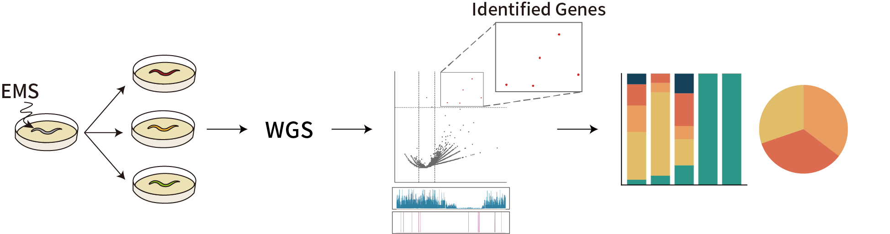
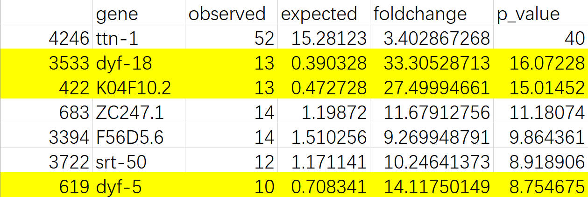
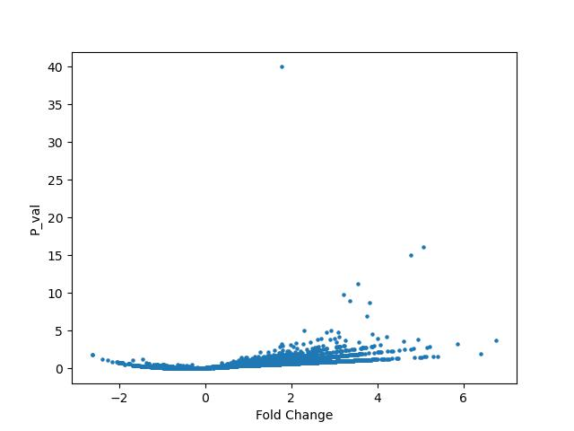

# EMS Mutagenesis Probability Map

## Introduction

Based on the Random Forest model, our pipeline utilizes Whole Genome Sequencing (WGS) data from genetic suppressor screenings to identify causative mutations without the need to generate recombinant inbred lines.



## Publication

[Zhengyang Guo, Shimin Wang, Yang Wang, Zi Wang, and Guangshuo Ou. (2024). A Machine Learning Enhanced EMS Mutagenesis Probability Map for Efficient Identification of Causal Mutations in _Caenorhabditis elegans_.](https://www.biorxiv.org/content/10.1101/2024.02.15.580605v1)

# Table of Contents

- [Introduction](#ems-mutagenesis-probability-map)
- [Getting Started](#getting-started)
  - [Dependencies](#dependencies)
  - [Installation](#installation)
- [Usage](#usage)
  - [Parameters](#parameters)
  - [Examine the Output](#examine-the-output)

## Getting Started

### Dependencies

The pipline requires the following packages:

- [scipy](https://scipy.org/)
- [pandas](https://pandas.pydata.org/)
- [tqdm](https://github.com/tqdm/tqdm)
- [matplotlib](https://matplotlib.org/)

You can install these packages from [PyPI](https://pypi.python.org/pypi/multiqc/)
using `pip`:

```
pip install scipy pandas tqdm matplotlib
```

### Installation

The `model` and the `gene range file` can be downloaded from [Zenodo](https://zenodo.org/records/12744471).   
The `python script` can be downloaded from this repository.

`gene range file` can be customized according to the newest version of genome annotation. 

## Usage

### Parameters

| Option     | Description                                                                                                                                                            |
| ------------- |------------------------------------------------------------------------------------------------------------------------------------------------------------------------|
| --model       | The path to the model file                                                                                                                                             |
| --data        | The directory where the VCF file is located                                                                                                                            |
| --ref        | The path to the gene range file                                                                                                                                        |
| --threshold   | The threshold for excluding background mutations. When the same variation is observed n times in your data, it will be considered a background mutation and discarded. |
| --out    | The path where the output file will be saved                                                                                                                           |
| --background  | (Optional) The path to the background file which contains the WGS data of a pre-mutated worm                                                                           |

The gene range file should be a `CSV` file with four columns. The first column represents the `gene name`, the second column denotes the `chromosome` ( 'I', 'II', ..., 'X') where the gene is located, the third column indicates the `starting position`, and the fourth column signifies the `end position`.

### Examine the output

A `volcano_table.csv` file and a `volcano.jpg` file should have been generated in the output folder. 

The `CSV` file contains the fold change and p-value for each gene showing mutations in the background-removed mutation pool. You can find the candidate gene by sorting by p-value. 



The `JPG` file is a volcano plot drawn based on the CSV file.

